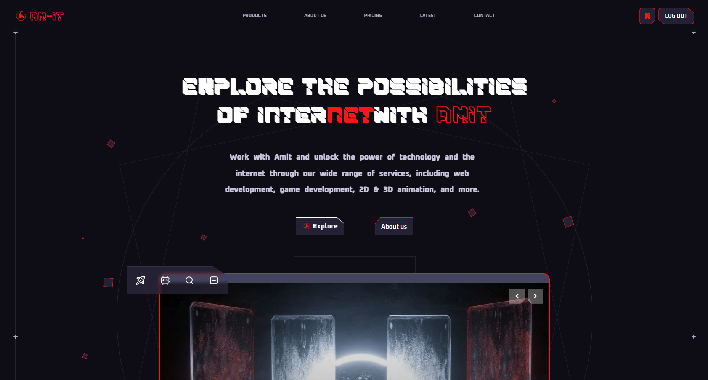

<!-- Add a project banner or logo below -->
<p align="center">
  
</p>

# ✨ AMIT Full Stack Web App

This is a full-stack web application built with **React + Vite** on the frontend and **Express + MongoDB** on the backend. It includes JWT-based authentication, Nodemailer integration for email handling, and is styled using Tailwind CSS.

---

## 📁 Project Structure

AMIT/
├── backend/
│ ├── controllers/
│ ├── db/
│ ├── middleware/
│ ├── models/
│ ├── nodemailer/
│ │ ├── emails.js
│ │ ├── emailTemplates.js
│ │ └── nodemailer.config.js
│ ├── routes/
│ ├── utils/
│ ├── .env
│ ├── index.js
│ ├── package.json
│ └── ...
├── frontend/
│ ├── public/
│ ├── src/
│ ├── index.html
│ ├── package.json
│ ├── tailwind.config.js
│ └── vite.config.js
└── README.md

---

## 🚀 Features

- 🔐 JWT-based authentication
- 📧 Email sending using **Nodemailer** and **Resend**
- 🌐 RESTful API with Express.js
- 🧠 MongoDB integration with Mongoose
- 🎨 Modern responsive UI with **Tailwind CSS**
- ⚛️ Built using **React 19**, **Framer Motion**, **Zustand**, and more
- 📦 Vite bundler for blazing-fast frontend development
- 📬 SMTP support with Mailtrap or Gmail
- 🔧 ESLint setup for consistent code quality

---

## 🛠️ Tech Stack

**Frontend:**
- React 19
- Vite
- Tailwind CSS
- Zustand, Swiper, Framer Motion, Lucide Icons
- Axios, Toast Notifications
- formspree


**Backend:**
- Node.js
- Express.js
- MongoDB + Mongoose
- Nodemailer
- bcryptjs, JWT

---

## ⚙️ .env Configuration (Backend)

Create a `.env` file inside the `backend/` folder:

```env
# MongoDB
MONGO_URI=your_mongo_connection_string

# Server
PORT=3000
NODE_ENV=development

# JWT
JWT_SECRET=yourSuperSecretKey

# Frontend URL
CLIENT_URL=http://localhost:5000

# Nodemailer (SMTP via Gmail)
SMTP_HOST=smtp.gmail.com
SMTP_PORT=465
SMTP_SECURE=true
SMTP_USER=example@gmail.com
SMTP_PASS=yourEmailPassword
SMTP_SENDER_NAME=Amit
📦 Installation & Setup
🔧 Backend
bash
Copy
Edit
cd backend
npm install
npm run dev   # or: npm start
💻 Frontend
bash
Copy
Edit
cd frontend
npm install
npm run dev
🌍 Live Demo
Add your deployed URL here
Example: https://amit-project.vercel.app

👤 Author
Name: Amit

Location: Vasai [E], Maharashtra, India

Email: example@gmail.com

📄 License
This project is licensed under the MIT License.

🧠 Contributions
Pull requests are welcome. For major changes, please open an issue first to discuss what you would like to change.